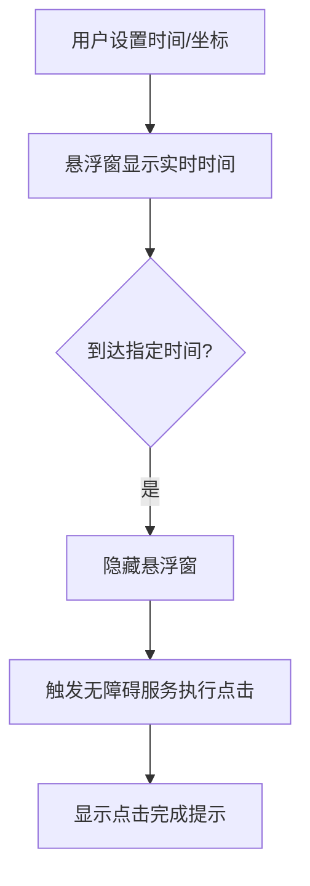

# AutoClicker - 自动点击器应用  

---

## **Project Background | 项目背景**  
My mother often participates in time-limited sales, but manual operations are too slow. To solve this, I developed AutoClicker—an Android app that simulates screen clicks at user-defined times and coordinates. This project was optimized with AI-assisted debugging and is open-sourced on GitHub,.This app was developed to solve the challenge of time-sensitive operations (e.g., flash sales) by automating screen clicks at user-defined times and coordinates. Inspired by **floating clock apps** that display real-time information, this project adds a critical innovation: **automated clicking functionality** while showing precise timing in a floating window. 
Since my mom started using this APP, snapping up items at the exact hour has become a piece of cake for her, and the success rate has soared. Every time she successfully grabs the desirable goods she wants, my mom can't help but praise me, saying, "This kid is so smart! He developed such a useful APP for me!" 
**开发背景：** 我妈妈经常参与整点抢购，但由于手动操作速度有限，成功率低。为此，我开发了 AutoClicker，一款安卓自动点击工具，支持在设定的时间和坐标自动执行点击。灵感来源于悬浮时钟类APP的实时信息展示功能，但增加了关键创新：**自动点击功能**，并在悬浮窗中显示精确时间。此项目通过AI辅助完成代码优化和问题调试，现开源在GitHub。
自从妈妈开始用这款 APP，整点抢购对她来说就变得轻而易举，成功率直线上升。每次成功抢购到心仪好物，妈妈都忍不住夸我：“这孩子，可真机灵，给我开发了这么好用的APP！”

---

## **Technical Highlights | 技术亮点**  
1. **Real-Time Floating Window | 实时悬浮窗**  
   Displays current time with **second precision** (e.g., `08:29:29`) before triggering clicks.  
   **功能亮点：** 执行点击前，悬浮窗实时显示精确到**秒级**的当前时间（如 `08:29:29`）。  

2. **Hybrid Design | 混合设计**  
   Combines the time-display logic of floating clock apps with automated click simulation, addressing a gap in existing tools.  
   **设计创新：** 融合悬浮时钟类APP的时间显示逻辑与自动点击功能，填补了现有工具的空白。  

3. **Precision Timing | 精准时序控制**  
   Uses `AlarmManager` and `RTC_WAKEUP` to achieve click timing with <10ms error margin.  
   **技术优势：** 基于 `AlarmManager` 和 `RTC_WAKEUP` 实现误差小于10毫秒的精准触发。  

4. **Cross-Process Coordination | 跨进程协同**  
   Coordinates between the floating window (UI), background service, and accessibility service.  
   **系统集成：** 实现悬浮窗（UI）、后台服务和无障碍服务的跨进程协同。  

---

## **Core Features | 核心功能**  
### 1. Floating Window with Time Display | 带时间显示的悬浮窗  
- **Real-Time Updates | 实时更新**  
  Continuously updates time using a `Handler` loop, synchronized with system clocks.  
  **实现原理：** 通过 `Handler` 循环与系统时钟同步，持续更新时间。  
- **Visual Feedback | 视觉反馈**  
  Shows countdown or real-time clock to enhance user trust in timing accuracy.  
  **用户体验：** 显示倒计时或实时时钟，增强用户对时间精度的信任。  

### 2. Automated Click Workflow | 自动点击流程  
**Demo Video**:<https://youtube.com/shorts/9eFLo0zvitk>


---

## **Technical Implementation | 技术实现**  
### 1. Floating Window Design | 悬浮窗设计  
- **参考悬浮时钟APP的架构：**  
  Used `WindowManager` to create an overlay view, similar to floating clock apps, but added dynamic time formatting and click-trigger logic.  
  **实现细节：** 基于 `WindowManager` 创建覆盖层视图（参考悬浮时钟APP），但新增动态时间格式化和点击触发逻辑。  
- **代码片段：**  
  ```java
  // 更新悬浮窗时间
  handler.postDelayed(new Runnable() {
      @Override
      public void run() {
          textView.setText(getCurrentTimeWithMillis());
          handler.postDelayed(this, 10); // 每10ms更新一次
      }
  }, 10);
  ```

### 2. Key Improvements Over Floating Clock Apps | 相较于悬浮时钟APP的改进  
| Feature Comparison      | Floating Clock App       | AutoClicker            |  
|-------------------------|--------------------------------------|--------------------------------------|  
| **Core Functionality**  | Time display only                    | Time display + **Auto-clicking**     |  
| **Trigger Logic**       | None                                 | Millisecond-level timed triggering   |  
| **System Permissions**  | Only requires floating window access | Requires floating window + accessibility service permissions |  

Key differences explained:  
1. **Core Functionality**: Floating clock apps focus solely on time visualization with various display styles, while AutoClickers integrate timing functions with automated click operations for tasks like gaming/shopping assistance.  
2. **Trigger Mechanism**: AutoClickers require precise timing configuration (millisecond accuracy) to execute automated actions, unlike passive clock displays.  
3. **Permissions**: AutoClickers need deeper system access (accessibility services) to simulate user interactions, whereas floating clocks only need basic overlay permissions.

| 功能对比         | 悬浮时钟APP               | AutoClicker                  |  
|------------------|---------------------------|------------------------------|  
| **核心功能**     | 仅显示时间                | 时间显示 + **自动点击**      |  
| **触发逻辑**     | 无                        | 毫秒级定时触发               |  
| **系统权限**     | 仅需悬浮窗权限            | 需悬浮窗 + 无障碍服务权限    |  

---

## **Challenges & Solutions | 开发挑战与解决方案**  
1. **悬浮窗与点击服务的协同**  
   - **Challenge:** Coordinating floating window visibility with click execution.  
   - **Solution:** Hide the window via `Broadcast` before clicking and restore it afterward.  
   - 问题：悬浮窗需持续显示时间，但点击时需隐藏以避免遮挡。  
   - 解决：通过 `Broadcast` 在点击前隐藏悬浮窗，完成后恢复显示。

2. **跨版本兼容性**  
   - **Challenge:** Android 12+ restrictions on exact alarms.  
   - **Solution:** Dynamically detect OS version and switch between `setExact()` and `setAlarmClock()`.  
   - 问题：Android 12+ 对精确闹钟的限制。  
   - 解决：动态检测版本并适配 `setExact()` 或 `setAlarmClock()`。  

---

## **Future Plans | 未来计划**  
1. **Multi-Window Support | 多悬浮窗支持**  
   Allow users to track multiple countdowns simultaneously.  
   **功能扩展：** 支持同时追踪多个倒计时任务。  
2. **Accessibility Event Filtering | 无障碍事件过滤**  
   Improve efficiency by filtering irrelevant `AccessibilityEvent` data.  
   **性能优化：** 通过过滤无关的无障碍事件提升效率。  

---

**License:** Apache 2.0  

